# PAGI Gateway Core + Python Adapter

[](https://github.com/c04ch1337/pagi-gateway-core/actions/workflows/ci.yaml)
[](LICENSE)


PAGI (Polyglot AI Gateway Infrastructure) is a **research-friendly, production-capable AI gateway**.

The authoritative ingress is **Rust** ([`pagi-gateway-core`](pagi-gateway-core/Cargo.toml)). Language-specific logic lives in **sidecar adapters** that register with the core (gRPC / Unix sockets).

This repository ships a runnable MVP:

- 🦀 Rust core: protocol ingress, canonicalization, adapter registry, metrics
- 🐍 Python adapter: AI middleware as pure-ish functions over canonical requests

## Table of contents

- [Features](#features)
- [Installation](#installation)
- [Usage](#usage)
- [Design](#design)
  - [High-level architecture](#high-level-architecture)
  - [Low-level request flow](#low-level-request-flow)
  - [Canonical request format](#canonical-request-format)
- [Repository layout](#repository-layout)
- [Contributing](#contributing)
- [License](#license)
- [Acknowledgments](#acknowledgments)

## Features

- ✅ **Single ingress core (Rust)**: REST + GraphQL HTTP endpoints (MVP), gRPC registry
- ✅ **Canonical internal request** to prevent N² protocol/adapter translation
- ✅ **Adapter registry**: adapters register with the core; adapters are *not peers*
- ✅ **Observability**: Prometheus metrics endpoint (`/metrics`)
- ✅ **Request replay**: append canonical requests to a log file (configurable)
- ✅ **Bare-metal first**: compile/run with `cargo`, `python`, etc.
- 🧩 Extensible skeletons for Go/Java adapters
- 🧪 Tests: Rust unit tests + Python pytest skeleton

## Installation

### Prerequisites

- Rust toolchain (via rustup)
- Python 3.11+ with venv + pip (Debian/Ubuntu: `python3-venv` + `python3-pip`)

Optional:

- `protoc` for generating stubs for Go/Java (Rust uses vendored `protoc` in build)

### Clone

```bash
git clone git@github.com:c04ch1337/pagi-gateway-core.git
cd pagi-gateway-core
```

## Usage

### 1) (Optional) Generate protobuf stubs

Rust builds generate gRPC code automatically (vendored `protoc`). Python/Go/Java stubs are generated via:

```bash
./tools/generate-protos.sh
```

### 2) Start the Rust core (HTTP `:8282`, gRPC `:50051`)

```bash
cd pagi-gateway-core
cargo run
```

Endpoints:

- `GET http://127.0.0.1:8282/healthz`
- `GET http://127.0.0.1:8282/metrics`
- `POST http://127.0.0.1:8282/v1/ai:call`
- `POST http://127.0.0.1:8282/graphql` (MVP)

### 3) Start the Python adapter (gRPC `:6000`)

```bash
cd adapters/pagi-adapter-python
python3 -m venv .venv
. .venv/bin/activate
pip install -r requirements.txt

# generate python stubs into src/pagi_contracts/
../../tools/generate-protos.sh

python -m src.main
```

The adapter registers with the Rust core registry at `127.0.0.1:50051`.

### 4) Send a request (REST)

```bash
curl -sS -X POST http://127.0.0.1:8282/v1/ai:call \
  -H 'content-type: application/json' \
  -d '{"agent_id":"demo","intent":"INTENT_CHAT","payload":{"text":"hello"}}'
```

## Configuration

### Core config (YAML)

The Rust core reads a unified YAML config (default: [`config/pagi.yaml`](config/pagi.yaml)).

Key settings:

- `core.bind_http`: HTTP bind address (default in example: `127.0.0.1:8282`)
- `core.bind_grpc`: gRPC bind address (default in example: `127.0.0.1:50051`)
- `core.request_replay.enabled`: append canonical requests to a replay log

Override the config path with:

```bash
export PAGI_CONFIG=../config/pagi.yaml
```

### Python adapter config (env)

The Python adapter is configured via env vars in [`load_config()`](adapters/pagi-adapter-python/src/config.py:9):

- `PAGI_ADAPTER_ID` (default: `python`)
- `PAGI_ADAPTER_BIND` (default: `127.0.0.1:6000`)
- `PAGI_CORE_GRPC` (default: `127.0.0.1:50051`)

## Examples

### 1) Legacy MVP request (still supported)

This is the original minimal shape; the core converts it into a single canonical `messages[]` entry.

```bash
curl -sS -X POST http://127.0.0.1:8282/v1/ai:call \
  -H 'content-type: application/json' \
  -d '{"agent_id":"demo","intent":"INTENT_CHAT","payload":{"text":"hello"}}'
```

### 2) Canonical multimodal/chat request (recommended)

```bash
curl -sS -X POST http://127.0.0.1:8282/v1/ai:call \
  -H 'content-type: application/json' \
  -d '{
    "agent_id": "demo",
    "session_id": "sess-123",
    "messages": [
      {"role":"system","content":[{"type":"text","text":"You are a helpful assistant."}]},
      {"role":"user","content":[{"type":"text","text":"Summarize this."},{"type":"file","url":"https://example.com/doc.pdf","mime_type":"application/pdf"}]}
    ],
    "constraints": {"max_tokens": 256, "temperature": 0.2, "stream": false},
    "metadata": {"user_id":"u-42","trace_tag":"demo"}
  }'
```

### 3) Tool calling request (schema-first)

```bash
curl -sS -X POST http://127.0.0.1:8282/v1/ai:call \
  -H 'content-type: application/json' \
  -d '{
    "agent_id": "demo",
    "messages": [
      {"role":"user","content":[{"type":"text","text":"What is the weather in Austin?"}]}
    ],
    "tools": [
      {
        "name": "get_weather",
        "description": "Get current weather by city",
        "parameters_json_schema": {
          "type": "object",
          "properties": {"city": {"type": "string"}},
          "required": ["city"]
        },
        "strict": true
      }
    ],
    "tool_choice": "auto",
    "preferred_model": "gpt-4o-mini"
  }'
```

## Backend integration instructions

### Backend use-case A: call the gateway over REST

From any backend (Node/Python/Go/Java), send the canonical JSON to the Rust core HTTP endpoint.
The only requirement is that your JSON can be parsed into [`CanonicalIngressRequest`](pagi-gateway-core/src/protocols/rest.rs:23).

### Backend use-case B: implement a new adapter

1. Implement the gRPC service defined in [`contracts/agent.proto`](contracts/agent.proto):
   - `AdapterRegistry.Register` (core side)
   - `AdapterService.Process` (adapter side)
2. Run `./tools/generate-protos.sh` to generate language stubs.
3. Start your adapter and register it with the core by calling `Register(adapter_id, endpoint, capabilities, version)`.

## Frontend integration instructions

### Frontend use-case A: browser `fetch()` to REST

```js
await fetch('http://127.0.0.1:8282/v1/ai:call', {
  method: 'POST',
  headers: { 'content-type': 'application/json' },
  body: JSON.stringify({
    agent_id: 'demo',
    session_id: 'sess-123',
    messages: [
      { role: 'user', content: [{ type: 'text', text: 'Hello from the browser' }] }
    ],
    constraints: { max_tokens: 128, temperature: 0.7 }
  })
}).then(r => r.json())
```

### Frontend use-case B: GraphQL

The MVP GraphQL schema includes `ping` and a simple `aiCall(agentId, text)` mutation.

```bash
curl -sS http://127.0.0.1:8282/graphql \
  -H 'content-type: application/json' \
  -d '{"query":"mutation { aiCall(agentId:\"demo\", text:\"hello\") }"}'
```

## Design

### High-level architecture

```mermaid
flowchart LR
  C[Clients\nREST / GraphQL / gRPC / WS] --> CORE[pagi-gateway-core (Rust)\nauth + rate limit + observability\ncanonical request]
  CORE --> REG[Adapter Registry (gRPC)]
  REG --> PY[pagi-adapter-python\nAI middleware]
  REG --> GO[pagi-adapter-go\n(agent workflows)\nplaceholder]
  REG --> JAVA[pagi-adapter-java\n(enterprise)\nplaceholder]
  CORE --> METRICS[/metrics\nPrometheus]

  classDef client fill:#1f77b4,stroke:#0b2d4d,color:#ffffff;
  classDef core fill:#d62728,stroke:#5a0f10,color:#ffffff;
  classDef reg fill:#9467bd,stroke:#3e2a58,color:#ffffff;
  classDef adapter fill:#2ca02c,stroke:#145214,color:#ffffff;
  classDef obs fill:#ff7f0e,stroke:#6b3a05,color:#ffffff;

  class C client;
  class CORE core;
  class REG reg;
  class PY,GO,JAVA adapter;
  class METRICS obs;
```

### Low-level request flow

```mermaid
sequenceDiagram
  autonumber
  participant Client
  participant Core as Rust Core (:8282)
  participant Reg as Registry (in Core)
  participant Py as Python Adapter (:6000)

  Client->>Core: POST /v1/ai:call (JSON)
  Core->>Core: Translate → CanonicalAIRequest
  Core->>Reg: Select adapter (registered)
  Core->>Py: gRPC AdapterService.Process(CanonicalAIRequest)
  Py->>Py: token_count + model_route
  Py-->>Core: CanonicalAIResponse(json)
  Core-->>Client: 200 JSON
```



### Canonical request format

The canonical request is the internal contract that prevents N² protocol translations.

- Rust internal type: [`CanonicalAIRequest`](pagi-gateway-core/src/canonical.rs)
- Protobuf contract: [`CanonicalAIRequest`](contracts/agent.proto)

Fields include `request_id`, `agent_id`, `intent`, `constraints`, and a `payload` oneof.

## Repository layout

- [`contracts/`](contracts/agent.proto) — shared Protobuf IDLs
- [`pagi-gateway-core/`](pagi-gateway-core/src/main.rs) — Rust ingress core
- [`adapters/`](adapters/) — language adapters/plugins
- [`config/`](config/pagi.yaml) — example unified YAML config (`bind_http: 127.0.0.1:8282`)
- [`tools/`](tools/) — shared scripts (protobuf generation)
- [`deployment/`](deployment/run.sh) — bare-metal run scripts (Docker is optional and isolated)
- [`docs/`](docs/architecture.md) — deeper documentation

## Contributing

See [`CONTRIBUTING.md`](CONTRIBUTING.md). (Core contribution rules are enforced: adapters register with core; no peer ingress.)

## License

MIT — see [`LICENSE`](LICENSE).

## Acknowledgments

- Rust async ecosystem: Tokio, Hyper, Tonic
- Protobuf / gRPC tooling
- Prometheus client libraries
